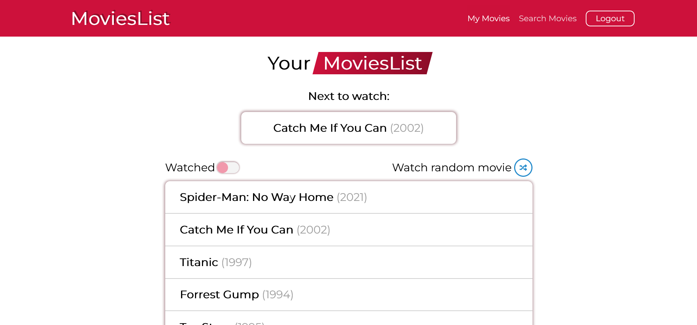

- [Overview](#overview)
  - [Screenshot](#screenshot)
  - [Links](#links)
- [My process](#my-process)
  - [Built with](#built-with)
- [Author](#author)

## Overview

This is my first React practice project. It is app for searching movies, adding and removing them from watchlist, marking as watched. Searching movies is powered by [TMDB](/https://www.themoviedb.org/) API.

### Screenshot

### Links

- Live Site URL: https://movieslist-ee4b0.web.app/

## My process

### Built with

- Semantic HTML5 markup
- Flexbox
- Mobile-first workflow
- [React](https://reactjs.org/) - JS library
- [Redux](https://redux.js.org/) - For movies store
- [Font Awesome](https://fontawesome.com/) - For icons
- [Firebase](https://firebase.google.com/) - For Auth, Database, Hosting

## Author

Radosław Łaszek
